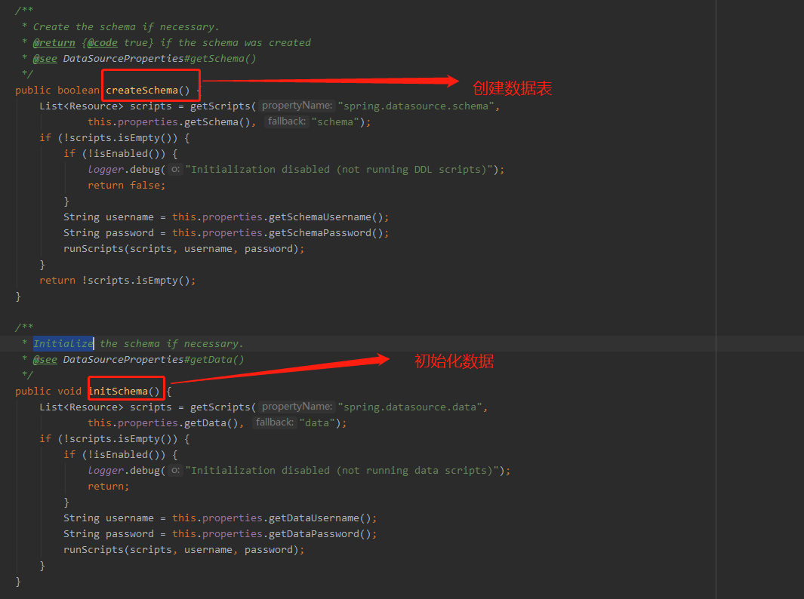
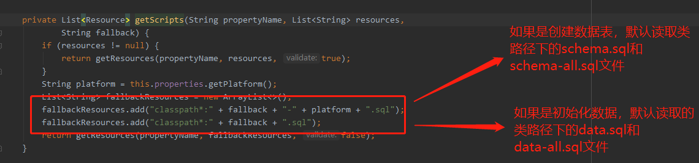
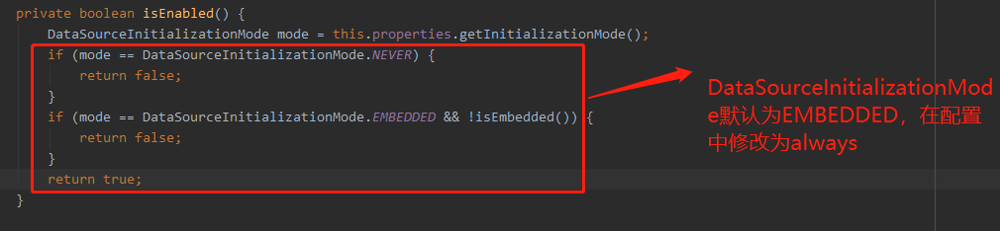

## JDBC

### 数据初始化

 Spring JDBC有一个初始化`DataSource`特性，Spring Boot默认启用该特性，并从标准的位置`schema.sql`和`data.sql`（位于classpath根目录）加载SQL。 

`org.springframework.boot.autoconfigure.jdbc.DataSourceInitializer`提供了创建数据表和插入数据的方法







### 使用步骤

**建表**

1、引入依赖

```xml
 <dependency>
            <groupId>mysql</groupId>
            <artifactId>mysql-connector-java</artifactId>
            <version>5.1.47</version>
        </dependency>

        <dependency>
            <groupId>org.springframework.boot</groupId>
            <artifactId>spring-boot-starter-jdbc</artifactId>
        </dependency>
```

2、添加配置

```properties
spring:
  datasource:
    name: root
    password: root
    url: jdbc:mysql://localhost:3306/spring-boot-jdbc?useSSL=false&useUnicode=true&characterEncoding=UTF8
    driver-class-name: com.mysql.jdbc.Driver
    schema-username: root
    schema-password: root
    initialization-mode: always
```

3、在classpath下添加建表语句。schema.sql

```sql
drop table if exists user;
create table user
(
    id       bigint(20) not null auto_increment,
    username varchar(40) DEFAULT NULL,
    password varchar(40) DEFAULT NULL,
    primary key (id)
) ENGINE = InnoDB
  DEFAULT CHARSET = utf8;
```

4、如果想添加类路径下指定的文件

```properties
schema:
      - classpath:sql/person.sql
      - classpath:sql/user.sql
```

5、如果这是一个JPA应用，建表语句会冲突

```properties
ddl-auto: create-drop
```

6、如果建表语句中出现错误，仍想继续启动应用

```properties
continue-on-error: true
```

**初始化数据**

1、添加配置

```properties
 data-username: root
 data-password: root
```

2、在classpath下添加建表语句。data.sql

```sql
INSERT INTO `person` VALUES ('1', 'tom', '2');
```

3、如果加载类指定位置的sql，eg:user.sql

添加配置

```shell
 data:
      - classpath:sql/user.sql
```

```sql
INSERT INTO `user` VALUES ('1', 'tom', '123');
INSERT INTO `user` VALUES ('2', 'lucy', '321');
```

