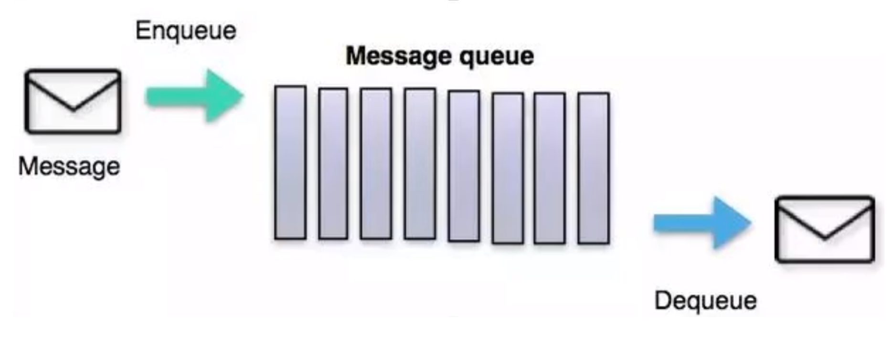
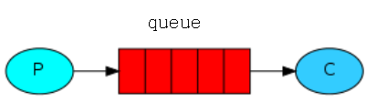
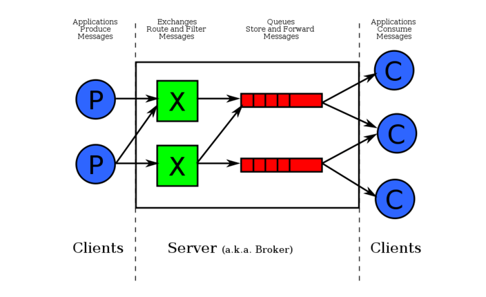
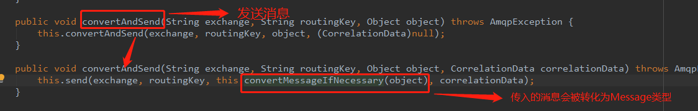
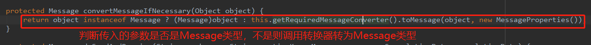
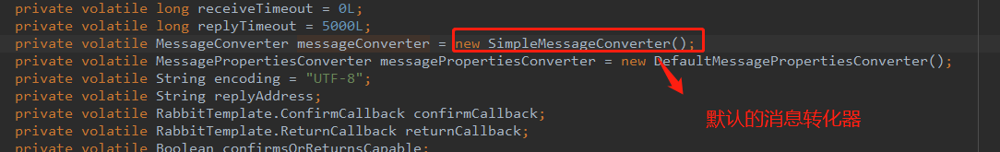

## MQ

### 定义

面向消息的中间件（message-oriented middleware）MOM能够很好的解决以上问题，是指利用高效可靠的消息传递机制与平台无关的数据交流，并基于数据通信来进行分布式系统的集成。
通过提供消息传递和消息排队模型在分布式环境下提供应用解耦，弹性伸缩，冗余存储、流量削峰，异步通信，数据同步等功能。

大致的过程是这样的：
发送者把消息发送给消息服务器，消息服务器将消息存放在若干队列/主题topic中，在合适的时候，消息服务器回将消息转发给接受者。在这个过程中，发送和接收是异步的，也就是发送无需等待，而且发送者和接受者的生命周期也没有必然的关系；
尤其在发布pub/订阅sub模式下，也可以完成一对多的通信，即让一个消息有多个接受者。



### 作用

- 解耦：当新的模块进来时，要做到代码改动最小，能够解耦
- 削峰：设置流量缓冲池，可以让后端系统按照自身吞吐能力进行消费，不被冲垮，能够削峰
- 异步：强弱依赖梳理能够将非关键调用链路的操作异步化并提升整体系统的吞吐能力，能够异步

### 种类

- Kafka
- RabbitMQ
- RocketMQ
- ActiveMQ


### AMQP 和 JMS

MQ是消息通信的模型；实现MQ的大致有两种主流方式：AMQP、JMS。

#### AMQP

AMQP是一种协议，更准确的说是一种binary wire-level protocol（链接协议）。这是其和JMS的本质差别，AMQP不从API层进行限定，而是直接定义网络交换的数据格式。


####  JMS

JMS即Java消息服务（JavaMessage Service）应用程序接口，是一个Java平台中关于面向消息中间件（MOM）的API，用于在两个应用程序之间，或分布式系统中发送消息，进行异步通信。


####  AMQP 与 JMS 区别

- JMS是定义了统一的接口，来对消息操作进行统一；AMQP是通过规定协议来统一数据交互的格式
- JMS限定了必须使用Java语言；AMQP只是协议，不规定实现方式，因此是跨语言的。
- JMS规定了两种消息模式；而AMQP的消息模式更加丰富


### 消息发送和接收机制

所有 MQ 产品从模型抽象上来说都是一样的过程：

消费者(com.kxj.config.consumer)订阅某个队列。生产者(com.kxj.producer)创建消息，然后发布到队列(queue)中，最后将消息发送到监听的消费者

  


## RabbitMQ

### 结构图



### 执行流程

 

### 相关概念

- Message

消息，消息是不具名的，它由消息头和消息体组成。消息体是不透明的，而消息头则由一系列的可选属性组成，这些属性包括routing-key(路由键)、priority(相对于其他消息的优先权)、delivery-mode(指出该消息可能需要持久性存储)等。

- Publisher

消息的生产者，也是一个向交换器发布消息的客户端应用程序。

- Exchange

交换器，用来接收生产者发送的消息并将这些消息路由给服务器中的队列。

- Binding

绑定，用于消息队列和交换器之间的关联。一个绑定就是基于路由键将交换

器和消息队列连接起来的路由规则，所以可以将交换器理解成一个由绑定构成的路由表。

- Queue

消息队列，用来保存消息直到发送给消费者。它是消息的容器，也是消息的终点。一个消息可投入一个或多个队列。消息一直在队列里面，等待消费者连到这个队列将其取走。

- Connection

网络连接，比如一个TCP连接。

- Channel

信道，多路复用连接中的一条独立的双向数据流通道。信道是建立在真实的TCP连接内地虚拟连接，AMQP 命令都是通过信道发出去的，不管是发布消息、订阅队列还是接收消息，这些动作都是通过信道完成。因为对于操作系统来说建立和销毁 TCP 都是非常昂贵的开销，所以引入了信道的概念，以复用一条 TCP连接。

- Consumer

消息的消费者，表示一个从消息队列中取得消息的客户端应用程序。

- Virtual Host

虚拟主机，表示一批交换器、消息队列和相关对象。虚拟主机是共享相同的

身份认证和加密环境的独立服务器域。每个 vhost 本质上就是一个 mini 版的

RabbitMQ 服务器，拥有自己的队列、交换器、绑定和权限机制。vhost 是 AMQP概念的基础，必须在连接时指定，RabbitMQ 默认的 vhost 是 / 。 


### 分发策略

- direct 

  点对点

- fanout

  广播

- topic

  匹配相对路径

  '#' 匹配一个字符

  '*' 匹配多个字符


### 安装

- 下载镜像

  ```shell
  docker pull rabbitmq:tag
  
  # docker pull rabbitmq (镜像未配有控制台)
  # docker pull rabbitmq:management (镜像配有控制台)
  ```

- 启动容器

  ```shell
  docker run --name rabbitmq -d -p 15672:15672 -p 5672:5672 rabbitmq:management
  # 15672是管理界面的端口
  # 5672 是服务的端口
  # RABBITMQ_DEFAULT_USER=user -e RABBITMQ_DEFAULT_PASS=password 不配置默认登录界面账号密码都是guest
  ```

   

### 自动配置原理

`RabbitAutoConfiguration`

- 自动配置了 连接工厂 `CachingConnectionFactory`
- `RabbitProperties`   封装了所有配置
- `RabbitTemplate` 给RabbitMQ发送和接收消息
-  `AmqpAdmin`  RabbitMQ系统管理功能组件










**序列化**

- 重新定义消息转换器

  

  ```java
  @Configuration
  public class RabbitConfig {
  
      @Bean
      public MessageConverter messageConverter() {
          return new Jackson2JsonMessageConverter();
      }
  
  }
  ```


### 入门案例

#### hello world


1. 引入依赖

   ```xml
   <dependency>
       <groupId>com.rabbitmq</groupId>
       <artifactId>amqp-client</artifactId>
   </dependency>
   ```

2. 生产者

   ```java
   public class producer {
   
       private static final String QUEUE_NAME = "hello";
   
       public static void main(String[] args) {
           ConnectionFactory connectionFactory = new ConnectionFactory();
           connectionFactory.setHost("47.102.218.26");
           connectionFactory.setPort(5672);
           try (Connection connection = connectionFactory.newConnection()) {
               Channel channel = connection.createChannel();
               /**
                *
                * queueDeclare(String queue, boolean durable, boolean exclusive, boolean autoDelete, Map<String, Object> arguments)
                *
                * queue：队列名称
                * durable：是否持久化，当mq重启后，消息还在
                * exclusive：
                *      1、是否独占，只能有一个消费者监听这队列
                *      2、当Connection关闭时，是否删除队列
                * autoDelete：是否自动删除。当没有Consumer时，自动删除掉
                * arguments：参数
                */
   
               channel.queueDeclare(QUEUE_NAME, false, false, false, null);
               // 使用默认的交换器，路由键需要设置队列名
               channel.basicPublish("", QUEUE_NAME, null, "hello world".getBytes());
               channel.close();
           } catch (IOException | TimeoutException e) {
               e.printStackTrace();
           }
   
       }
   }
   ```

3. 消费者

   ```java
   public class consumer {
   
       private final static String QUEUE_NAME = "hello";
   
       public static void main(String[] args) throws IOException, TimeoutException {
           ConnectionFactory factory = new ConnectionFactory();
           factory.setHost("47.102.218.26");
           factory.setPort(5672);
   
           Connection connection = factory.newConnection();
           Channel channel = connection.createChannel();
   
           /**
            * 注意
            * Rabbitmq服务通道是持久通道,该queue 已经存在, 而且通道属性需要保持一致
            */
           channel.queueDeclare(QUEUE_NAME, false, false, false, null);
   
   //        DefaultConsumer consumer = new DefaultConsumer(channel) {
   //            /**
   //             *
   //             * @param consumerTag 标识
   //             * @param envelope 获取的一些信息 包括交换机 路由
   //             * @param properties 配置信息
   //             * @param body 数据
   //             * @throws IOException
   //             */
   //            @Override
   //            public void handleDelivery(String consumerTag, Envelope envelope, AMQP.BasicProperties properties, byte[] body) throws IOException {
   //                System.out.println("consumerTag:" + consumerTag);
   //                System.out.println("envelope:" + envelope);
   //                System.out.println("properties:" + properties);
   //                System.out.println("message:" + new String(body));
   //            }
   //        };
   //        channel.basicConsume(QUEUE_NAME, true, consumer);
   
           DeliverCallback deliverCallback = (consumerTag, delivery) -> {
               String message = new String(delivery.getBody(), "UTF-8");
               System.out.println(" message: " + message + "'");
           };
           /**
            * 启动一个消费者，并返回服务端生成的消费者标识
            * queue:队列名
            * autoAck：true 接收到传递过来的消息后acknowledged（应答服务器），false 接收到消息后不应答服务器
            * deliverCallback： 当一个消息发送过来后的回调接口
            * cancelCallback：当一个消费者取消订阅时的回调接口;取消消费者订阅队列时除了使用{@link Channel#basicCancel}之外的所有方式都会调用该回调方法
            * @return 服务端生成的消费者标识
            */
           channel.basicConsume(QUEUE_NAME, true, deliverCallback, consumerTag -> {
           });
   
       }
   }
   ```

#### work queue


**应用场景**：对于 任务过重或任务较多情况使用工作队列可以提高任务处理的速度

生产者同`hello wolrd`生产者代码

消费者同`hello wolrd`消费者代码，并复制一份

在一个队列中如果有多个消费者，那么消费者之间对于同一个消息的关系是**竞争**的关系


**生产者**

```java
ConnectionFactory connectionFactory = new ConnectionFactory();
connectionFactory.setHost("47.102.218.26");
connectionFactory.setPort(5672);
try (Connection connection = connectionFactory.newConnection()) {
    Channel channel = connection.createChannel();
    /**
     *
     * queueDeclare(String queue, boolean durable, boolean exclusive, boolean autoDelete, Map<String, Object> arguments)
     *
     * queue：队列名称
     * durable：是否持久化，当mq重启后，消息还在
     * exclusive：
     *      1、是否独占，只能有一个消费者监听这队列
     *      2、当Connection关闭时，是否删除队列
     * autoDelete：是否自动删除。当没有Consumer时，自动删除掉
     * arguments：参数
     */

    channel.queueDeclare(QUEUE_NAME, false, false, false, null);
    // 使用默认的交换器，路由键需要设置队列名
    for (int i = 0; i < 10; i++) {
        channel.basicPublish("", QUEUE_NAME, null, (i+"hello world").getBytes());
    }
    channel.close();
} catch (IOException | TimeoutException e) {
    e.printStackTrace();
}
```


**消费者**

```java
public class consumer01 {

    private final static String QUEUE_NAME = "hello";

    public static void main(String[] args) throws IOException, TimeoutException {
        ConnectionFactory factory = new ConnectionFactory();
        factory.setHost("47.102.218.26");
        factory.setPort(5672);

        Connection connection = factory.newConnection();
        Channel channel = connection.createChannel();
        channel.queueDeclare(QUEUE_NAME, false, false, false, null);

        DeliverCallback deliverCallback = (consumerTag, delivery) -> {
            String message = new String(delivery.getBody(), "UTF-8");
            System.out.println(" message: " + message + "'");
        };
        channel.basicConsume(QUEUE_NAME, true, deliverCallback, consumerTag -> {
        });

    }
}

public class consumer02 {

    private final static String QUEUE_NAME = "hello";

    public static void main(String[] args) throws IOException, TimeoutException {
        ConnectionFactory factory = new ConnectionFactory();
        factory.setHost("47.102.218.26");
        factory.setPort(5672);

        Connection connection = factory.newConnection();
        Channel channel = connection.createChannel();

        channel.queueDeclare(QUEUE_NAME, false, false, false, null);

        DeliverCallback deliverCallback = (consumerTag, delivery) -> {
            String message = new String(delivery.getBody(), "UTF-8");
            System.out.println(" message: " + message + "'");
        };
        channel.basicConsume(QUEUE_NAME, true, deliverCallback, consumerTag -> {
        });

    }
}

```


#### pub/sub 订阅模式


发布订阅模式：
1、每个消费者监听自己的队列。
2、生产者将消息发给broker，由交换机将消息转发到绑定此交换机的每个队列，每个绑定交换机的队列都将接收
到消息


1. ##### 生产者

   ```java
   private final static String FANOUT_QUEUE_1 = "fanout-queue-1";
   private final static String FANOUT_QUEUE_2 = "fanout-queue-2";
   private static final String FANOUT_EXCHANGE = "fanout-exchange";
   
   public static void main(String[] args) {
       ConnectionFactory connectionFactory = new ConnectionFactory();
       connectionFactory.setHost("47.102.218.26");
       connectionFactory.setPort(5672);
       try (Connection connection = connectionFactory.newConnection()) {
           Channel channel = connection.createChannel();
   
           /**
                * 声明交换机
                * exchangeDeclare(String exchange,BuiltinExchangeType type,boolean durable,boolean autoDelete,boolean internal,Map<String, Object> arguments)
                * exchange：交换机名称
                * type：交换机类型
                * durable：是否持久化
                * autoDelete：是否自动删除
                * internal：设置是否是RabbitMQ内部使用，默认false。如果设置为 true ，则表示是内置的交换器，客户端程序无法直接发送消息到这个交换器中，只能通过交换器路由到交换器这种方式
                * arguments：扩展参数，用于扩展AMQP协议自制定化使用
                */
           channel.exchangeDeclare(FANOUT_EXCHANGE, BuiltinExchangeType.FANOUT, true, false, false, null);
   
           // 设置交换机和队列的绑定
           channel.queueDeclare(FANOUT_QUEUE_1, true, false, false, null);
           channel.queueDeclare(FANOUT_QUEUE_2, true, false, false, null);
   
           /**
                * queueBind(String queue, String exchange, String routingKey)
                *
                * 1、queue：队列名称
                * 2、exchange：交换机名称
                * 3、routingKey：路由 fanout 路由设置为空字符转即可
                */
           channel.queueBind(FANOUT_QUEUE_1, FANOUT_EXCHANGE, "");
           channel.queueBind(FANOUT_QUEUE_2, FANOUT_EXCHANGE, "");
   
           // 发送消息
           channel.basicPublish(FANOUT_EXCHANGE, "", null, "hello topic".getBytes());
           channel.close();
       } catch (IOException | TimeoutException e) {
           e.printStackTrace();
       }
   }
   ```

2. 消费者同`hello world`消费者，修改监听队列名即可

   

**小结**

交换机需要与队列进行绑定，绑定之后；一个消息可以被多个消费者都收到。


**发布订阅模式与工作队列模式的区别**

1、工作队列模式不用定义交换机，而发布/订阅模式需要定义交换机。 

2、发布/订阅模式的生产方是面向交换机发送消息，工作队列模式的生产方是面向队列发送消息(底层使用默认交换机)。

3、发布/订阅模式需要设置队列和交换机的绑定，工作队列模式不需要设置，实际上工作队列模式会将队列绑 定到默认的交换机 


#### routing


- P：生产者，向Exchange发送消息，发送消息时，会指定一个routing key。

- X：Exchange（交换机），接收生产者的消息，然后把消息递交给 与routing key完全匹配的队列

- C1：消费者，其所在队列指定了需要routing key 为 error 的消息

- C2：消费者，其所在队列指定了需要routing key 为 info、error、warning 的消息

  

路由模式特点：

- 队列与交换机的绑定，不能是任意绑定了，而是要指定一个`RoutingKey`（路由key）
- 消息的发送方在 向 Exchange发送消息时，也必须指定消息的 `RoutingKey`。
- Exchange不再把消息交给每一个绑定的队列，而是根据消息的`Routing Key`进行判断，只有队列的`Routingkey`与消息的 `Routing key`完全一致，才会接收到消息


交换机的类型为：Direct，还有队列绑定交换机的时候需要指定routing key。

1. **生产者**

   ```java
   private final static String DIRECT_QUEUE_1 = "direct-queue-1";
   private final static String DIRECT_QUEUE_2 = "direct-queue-2";
   private static final String DIRECT_EXCHANGE = "direct-exchange";
   
   public static void main(String[] args) {
   
       ConnectionFactory connectionFactory = new ConnectionFactory();
       connectionFactory.setHost("47.102.218.26");
       connectionFactory.setPort(5672);
       try (Connection connection = connectionFactory.newConnection()) {
           Channel channel = connection.createChannel();
   
           channel.exchangeDeclare(DIRECT_EXCHANGE, BuiltinExchangeType.DIRECT, true, false, false, null);
   
           channel.queueDeclare(DIRECT_QUEUE_1, true, false, false, null);
           channel.queueDeclare(DIRECT_QUEUE_2, true, false, false, null);
   
           // 绑定交换机和队列，根据路由
           channel.queueBind(DIRECT_QUEUE_1, DIRECT_EXCHANGE, "error");
           channel.queueBind(DIRECT_QUEUE_2, DIRECT_EXCHANGE, "warning");
           channel.queueBind(DIRECT_QUEUE_2, DIRECT_EXCHANGE, "info");
           channel.queueBind(DIRECT_QUEUE_2, DIRECT_EXCHANGE, "error");
   
           // 发送消息
           channel.basicPublish(DIRECT_EXCHANGE, "error", null, "error 级别".getBytes());
           channel.basicPublish(DIRECT_EXCHANGE, "info", null, "info 级别".getBytes());
           channel.close();
       } catch (IOException | TimeoutException e) {
           e.printStackTrace();
       }
   }
   ```

   

2. **消费者**

   - 消费者1

     ```java
     public class consumer01 {
         private final static String FANOUT_QUEUE_1 = "direct-queue-1";
     
         public static void main(String[] args) throws Exception {
             ConnectionFactory factory = new ConnectionFactory();
             factory.setHost("47.102.218.26");
             factory.setPort(5672);
     
             Connection connection = factory.newConnection();
             Channel channel = connection.createChannel();
     
             channel.queueDeclare(FANOUT_QUEUE_1, true, false, false, null);
     
             DeliverCallback deliverCallback = (consumerTag, delivery) -> {
                 String message = new String(delivery.getBody(), "UTF-8");
                 System.out.println(" message: " + message + "'");
             };
             channel.basicConsume(FANOUT_QUEUE_1, true, deliverCallback, consumerTag -> {
             });
     
         }
     }
     ```

   - 消费者2

     ```java
     public class consumer02 {
         private final static String FANOUT_QUEUE_2 = "direct-queue-2";
     
         public static void main(String[] args) throws Exception {
             ConnectionFactory factory = new ConnectionFactory();
             factory.setHost("47.102.218.26");
             factory.setPort(5672);
     
             Connection connection = factory.newConnection();
             Channel channel = connection.createChannel();
     
             channel.queueDeclare(FANOUT_QUEUE_2, true, false, false, null);
     
             DeliverCallback deliverCallback = (consumerTag, delivery) -> {
                 String message = new String(delivery.getBody(), "UTF-8");
                 System.out.println(" message: " + message + "'");
             };
             channel.basicConsume(FANOUT_QUEUE_2, true, deliverCallback, consumerTag -> {
             });
         }
     }
     
     ```

   **小结**

   ​	Routing模式要求队列在绑定交换机时要指定routing key，消息会转发到符合routing key的队列。


#### topics


`Topic`类型与`Direct`相比，都是可以根据`RoutingKey`把消息路由到不同的队列。只不过`Topic`类型`Exchange`可以让队列在绑定`Routing key` 的时候**使用通配符**！


`Routingkey` 一般都是有一个或多个单词组成，多个单词之间以”.”分割，例如： `item.insert`

 通配符规则：

`#`：匹配一个或多个词

`*`：匹配不多不少恰好1个词

举例：

`item.#`：能够匹配`item.insert.abc` 或者 `item.insert`

`item.*`：只能匹配`item.insert`


**生产者**

```java
public class producer {

    private final static String TOPIC_QUEUE_1 = "topic-queue-1";
    private final static String TOPIC_QUEUE_2 = "topic-queue-2";
    private static final String TOPIC_EXCHANGE = "topic-exchange";

    public static void main(String[] args) {

        ConnectionFactory connectionFactory = new ConnectionFactory();
        connectionFactory.setHost("47.102.218.26");
        connectionFactory.setPort(5672);
        try (Connection connection = connectionFactory.newConnection()) {
            Channel channel = connection.createChannel();

            channel.exchangeDeclare(TOPIC_EXCHANGE, BuiltinExchangeType.TOPIC, true, false, false, null);

            channel.queueDeclare(TOPIC_QUEUE_1, true, false, false, null);
            channel.queueDeclare(TOPIC_QUEUE_2, true, false, false, null);

            // 绑定交换机和队列，根据路由
            channel.queueBind(TOPIC_QUEUE_1, TOPIC_EXCHANGE, "*.orange.*");
            channel.queueBind(TOPIC_QUEUE_1, TOPIC_EXCHANGE, "lazy.*");
            channel.queueBind(TOPIC_QUEUE_2, TOPIC_EXCHANGE, "*.*.rabbit");
            channel.queueBind(TOPIC_QUEUE_2, TOPIC_EXCHANGE, "lazy.#");

            // 发送消息
            channel.basicPublish(TOPIC_EXCHANGE, "fruit.orange.weight", null, "*.orange.*".getBytes());
            channel.basicPublish(TOPIC_EXCHANGE, "user.info.rabbit", null, "*.*.rabbit".getBytes());
            channel.basicPublish(TOPIC_EXCHANGE, "lazy.rabbit", null, "lazy.# / lazy.*".getBytes());
            channel.close();
        } catch (IOException | TimeoutException e) {
            e.printStackTrace();
        }
    }
}

```


**消费者**

```java
public class consumer01 {
    private final static String TOPIC_QUEUE_1 = "topic-queue-1";

    public static void main(String[] args) throws Exception {
        ConnectionFactory factory = new ConnectionFactory();
        factory.setHost("47.102.218.26");
        factory.setPort(5672);

        Connection connection = factory.newConnection();
        Channel channel = connection.createChannel();

        channel.queueDeclare(TOPIC_QUEUE_1, true, false, false, null);

        DeliverCallback deliverCallback = (consumerTag, delivery) -> {
            String message = new String(delivery.getBody(), "UTF-8");
            System.out.println(" message: " + message + "'");
        };
        channel.basicConsume(TOPIC_QUEUE_1, true, deliverCallback, consumerTag -> {
        });

    }
}

public class consumer02 {
    private final static String TOPIC_QUEUE_2 = "topic-queue-2";

    public static void main(String[] args) throws Exception {
        ConnectionFactory factory = new ConnectionFactory();
        factory.setHost("47.102.218.26");
        factory.setPort(5672);

        Connection connection = factory.newConnection();
        Channel channel = connection.createChannel();

        channel.queueDeclare(TOPIC_QUEUE_2, true, false, false, null);

        DeliverCallback deliverCallback = (consumerTag, delivery) -> {
            String message = new String(delivery.getBody(), "UTF-8");
            System.out.println(" message: " + message + "'");
        };
        channel.basicConsume(TOPIC_QUEUE_2, true, deliverCallback, consumerTag -> {
        });

    }
}
```


**小结**

Topic主题模式可以实现 `Publish/Subscribe发布与订阅模式` 和 ` Routing路由模式` 的功能；只是Topic在配置routing key 的时候可以使用通配符，显得更加灵活


